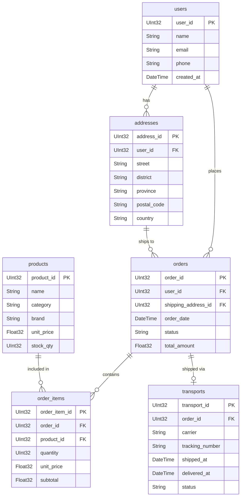

# E-Commerce ER Diagram

```mermaid
erDiagram
    users {
        UInt32 user_id PK
        String name
        String email
        String phone
        DateTime created_at
    }
    addresses {
        UInt32 address_id PK
        UInt32 user_id FK
        String street
        String district
        String province
        String postal_code
        String country
    }
    products {
        UInt32 product_id PK
        String name
        String category
        String brand
        Float32 unit_price
        UInt32 stock_qty
    }
    orders {
        UInt32 order_id PK
        UInt32 user_id FK
        UInt32 shipping_address_id FK
        DateTime order_date
        String status
        Float32 total_amount
    }
    order_items {
        UInt32 order_item_id PK
        UInt32 order_id FK
        UInt32 product_id FK
        UInt32 quantity
        Float32 unit_price
        Float32 subtotal
    }
    transports {
        UInt32 transport_id PK
        UInt32 order_id FK
        String carrier
        String tracking_number
        DateTime shipped_at
        DateTime delivered_at
        String status
    }

    users      ||--o{ addresses   : "has"
    users      ||--o{ orders      : "places"
    addresses  ||--o{ orders      : "ships to"
    orders     ||--o{ order_items : "contains"
    products   ||--o{ order_items : "included in"
    orders     ||--o| transports  : "shipped via"
```
